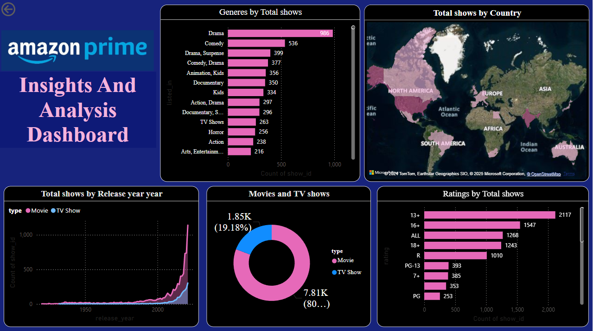

# 👋 Hey Everyone, I'm **Harinee**

### 🌌 Welcome to My GitHub Universe!

---

## 🚀 About Me
- 🌱 Passionate AI & Data Science student  
- 🎯 Focused on consistent learning  
- 🧠 Love building impactful ML & full-stack projects  
- 🤝 Open to collaborations  
- 💻 Always exploring something new  

---

## 🔗 Connect With Me

  <!-- GitHub -->
  

  <!-- LinkedIn -->
  

  <!-- Gmail -->
  

  <!-- WhatsApp -->
  

---

# 📈 GitHub Activity Overview

### 🔹 Contribution Stats (Auto-Updating)

  <!-- Total Contributions (approx via last commit badge) -->
  

  <!-- Active Days Streak -->
  

---

# 🧮 Coding Profiles (Auto-Updating)

### 🔸 LeetCode Stats

  

---

# 📊 GitHub Stats & Languages

  
  

---
# 💼 Featured Projects

---

## 🎯 **Project 1 – BI Hub: Business Intelligence Analytics Platform**

<table>
<tr>
<td width="30%">
  <!-- Replace with your project image -->
  
</td>
<td width="70%">

**Description:**  
The Business Intelligence Hub is a secure, full-stack web application that transforms raw data into actionable insights using advanced AI. It features an intelligent Customer Feedback Analyzer, a conversational "Chat with Data" engine, and automated AI dashboards with predictive sales forecasting. Built with Django and Google Gemini, this containerized solution bridges the gap between complex data and executive decision-making.

**Tech Stack:** Django 5, RAG Architecture, Pandas & Statsmodels, Chart.js.   
🔗 **Repo:** [BI Hub Project](https://github.com/Harinee-3010/bi-hub-project)

  
  
  

</td>
</tr>
</table>

---

## 🎯 **Project 2 – NextStep AI: Career Path Recommendation System**

<table>
<tr>
<td width="30%">
  <!-- Replace with your project image -->
  
</td>
<td width="70%">

**Description:**  
An AI-powered career navigator that analyzes user skills and interests to create a personalized career roadmap. Includes skill-gap analysis, role recommendations, curated learning resources, and market insights.

**Tech Stack:** HTML, CSS, JavaScript, ML/LLM Logic  
🔗 **Live:** [NextStep AI](https://harinee-3010.github.io/Next-step-AI/)

  
  

</td>
</tr>
</table>

---

## 🎯 **Project 3 – Amazon Prime Video Insights Dashboard**

<table>
<tr>
<td width="30%">
  <!-- Replace with your project image -->
  
</td>
<td width="70%">

**Description:**  
A Power BI dashboard revealing insights about Amazon Prime Video’s catalog. It includes genre trends, ratings distribution, global contributions, and movie vs series analysis.

**Tech Stack:** Power BI, Data Visualization  
🔗 **Repo:** [Amazon Prime Dashboard](https://github.com/Harinee-3010/Amazon_prime_Dashboard)

  

</td>
</tr>
</table>

---

---

# 🏆 Achievements & Awards

- 🧩 **1000+ problems solved** across LeetCode, CodeChef (Div 3), and Codeforces  
- 🥇 **Elite Certification – NPTEL Soft Skills Development**  
- 🥈 **2nd Prize Winner**, Technical Event at Karpagam College of Engineering  
- 🎯 **100+ Competitive Programming Contests** participated  
- 📄 **Research Paper Presented (ICCCSS 2025)** – *“LLM Powered Career Navigator”*  

  
  
  

