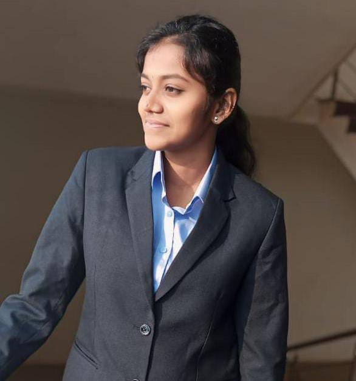

<!-- HEADER IMAGE / BANNER -->

---

## 👩‍💻 About Me

<table>
<tr>
<td width="30%" align="center">

</td>
<td width="70%" align="left">

I am an **AI & Data Science student** passionate about building intelligent, scalable systems using  
**Machine Learning, LLMs, and Full-Stack Engineering**.

- 🔍 Exploring: LLM Apps, Agentic AI, Full-Stack ML  
- 💻 Coding: 1000+ CP Problems  
- 🧠 Strong in Python, ML, Data Science  
- 🏆 Research Paper Published (ICCCSS 2025)

</td>
</tr>
</table>

## 🛠 Tech Stack

### **Languages**

  

### **AI / ML**

  

### **Frameworks**

  

### **Databases**

  

### **Tools**

  

---

## 📊 GitHub Stats

  
  

 

---

## 🐍 Contribution Snake

  

---

## 🧩 Competitive Programming Stats

### **LeetCode**

  

### **CodeChef**

  

---

## 🚀 Featured Projects

### 🔹 **Business Intelligence Hub — LLM Powered**
AI-powered BI assistant for automatic insights & visualization suggestions.  
**Tech:** Python, Pandas, Django, LLM API  
🔗 *Repo:* (add link)

---

### 🔹 **LLM-Powered Career Path Navigator**
AI system for personalized career recommendations using ML + LLM reasoning.  
**Tech:** HTML, CSS, JS, ML Models, LLM API  
🔗 *Repo:* (add link)

---

### 🔹 **Other Notable Works**
- Satellite-based Oil Spill Detection (AI + CV)
- Virtual Dressing Room (AR + CV)
- Student Progress Checker (Django + ML)

---

## 🏅 Achievements
- ⭐ Solved **1000+ CP problems**
- 🥈 2nd Prize – Tech Event @ KCE
- 📜 Elite NPTEL Certification – Soft Skills
- 🎓 Published Research Paper (ICCCSS 2025)

---

## ☕ Let's Connect
If you want to discuss AI, LLMs, career guidance, or fun side projects —  
**I'm always happy to connect!**

  
  
  

---
